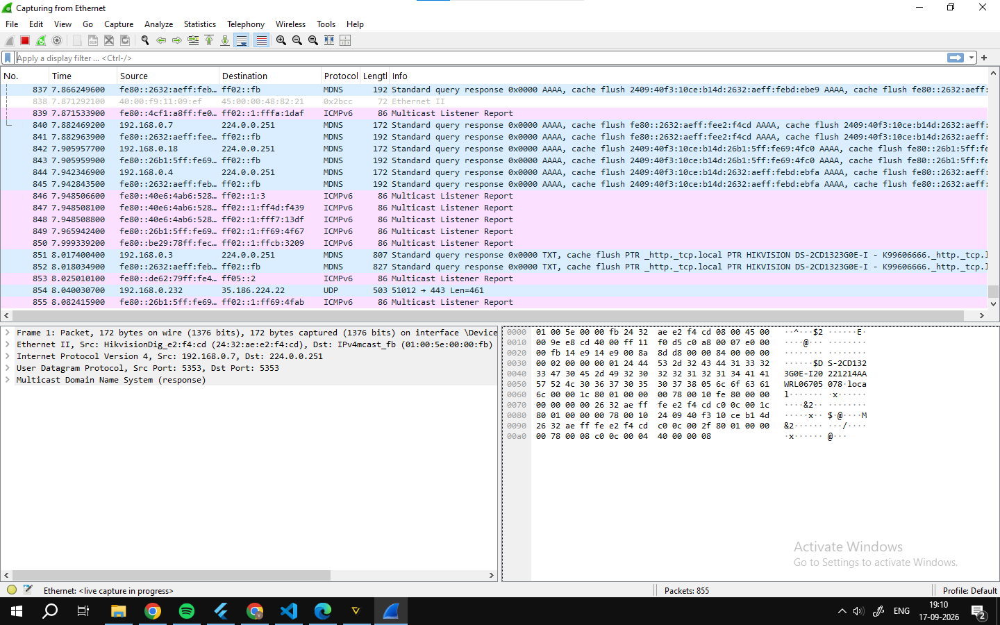
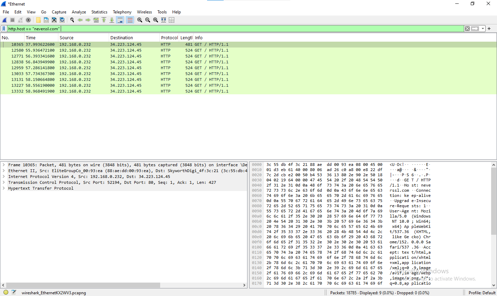

# 🔍 Network Triage & Wireshark Packet Analysis Lab
### Enterprise Network Traffic Monitoring & Threat Isolation 🛡️

This repository serves as a technical portfolio highlighting network security analysis, baseline discovery, and protocol auditing methodologies. By capturing and dissecting real-time network payloads, these case studies demonstrate a deep engineering focus on uncovering local subnet vulnerabilities, unencrypted data transport links, and localized connection anomalies.

---

## 🛠️ Analyst Toolkit
*   **Packet Inspection:** Wireshark, tcpdump
*   **Protocols Audited:** HTTP, mDNS, DNS, TCP (Handshake & Windowing), UDP, ARP
*   **Methodology Frameworks:** Network Baseling, Threat Isolation, MITRE ATT&CK Mapping

---

## 🚀 Deep-Dive Analysis Reports

### Case Study 1: Local mDNS Subnet Discovery & IoT Asset Leakage

During passive network monitoring, an unencrypted multicast DNS (mDNS) query response broadcasted across the local collision domain (`224.0.0.251`). By analyzing the payload, the host disclosed specific device identities without authentication.

#### 🔍 Technical Analysis of the Capture:
*   **Protocol:** mDNS (Multicast DNS over UDP Port 5353)
*   **Target Packet:** Packet **#851** & **#852**
*   **Source IP:** `192.168.0.7` -> Broadcasting to Destination: `224.0.0.251`
*   **Data Leakage Identified:** As seen in the Hex/ASCII dump pane, the plain-text string explicitly exposes the hardware vendor and exact model of an active surveillance unit on the local network:
    `HIKVISION DS-2CD123G0E-I`
*   **Mitigation Strategy:** Implement strict VLAN segregation to keep IoT surveillance equipment isolated from critical host subnets, and configure local firewall policies to block or restrict arbitrary outbound multicast queries.

---

### Case Study 2: Cleartext HTTP Traffic Inspection & Session Auditing

This analysis evaluates the security posture of traditional plaintext communication channels over the open internet. By inspecting traffic traversing an unencrypted transport medium, plaintext data footprints can be readily indexed, captured, and parsed without a cryptographic handshake layout.

#### 🔍 Technical Analysis of the Capture:
*   **Protocol/Layer:** Hypertext Transfer Protocol (HTTP / Application Layer)
*   **Target Packet Verified:** Packet **#10365** (Outbound `GET` Request)
*   **Internal Source Node:** `192.168.0.232` -> **Target Destination WAN Node:** `34.223.124.45`
*   **Data Footprint Disclosed:** The payload architecture explicitly transmits parameters in cleartext. As indexed in the Hex/ASCII layer pane (right side), critical transport attributes like the target application host structure (`Host: neverssl.com`) and local workstation identifiers (`User-Agent: Mozilla/5.0...`) cross the wire unencrypted.
*   **Mitigation Strategy:** Enforce global HTTP Strict Transport Security (HSTS) flags and migrate legacy web applications exclusively to HTTPS (TLS 1.3) execution contexts to shield metadata and prevent adversary-in-the-middle injection vectors.

---

### Case Study 3: Connection Anomalies & Session Resets

---

## 📜 Key Technical Takeaways
1. **Unencrypted Device Footprinting:** Discovered that embedded hardware network layers blindly stream internal asset telemetry over unencrypted channels, streamlining initial reconnaissance vectors for threat actors.
2. **Defensive Isolation:** Validated that logical network segmentation is an absolute priority over relying on vendor-level device configurations for security.
